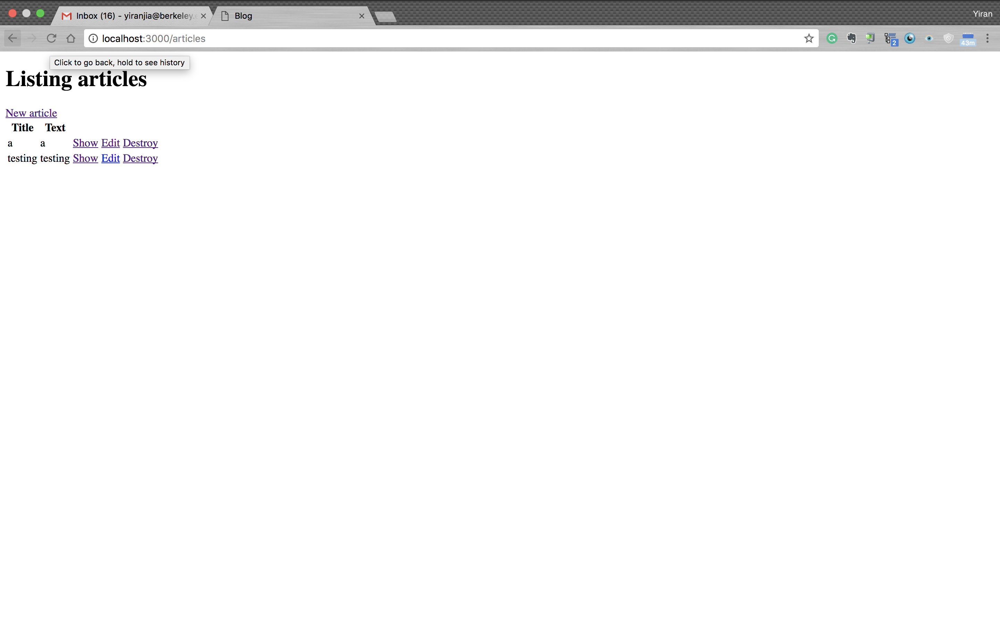
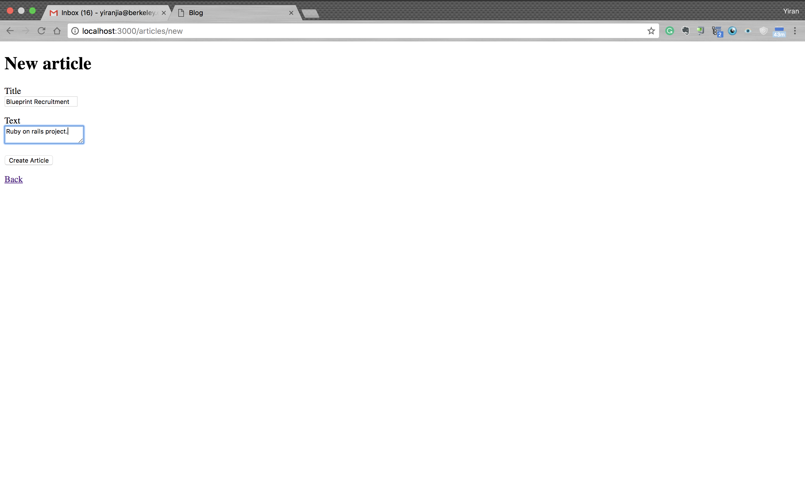
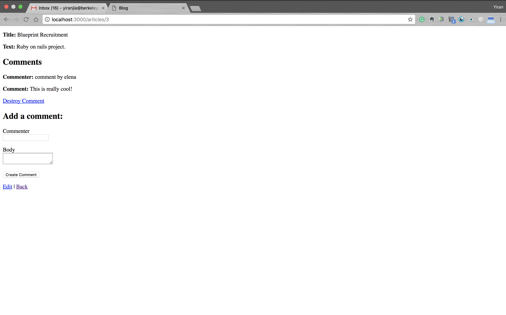
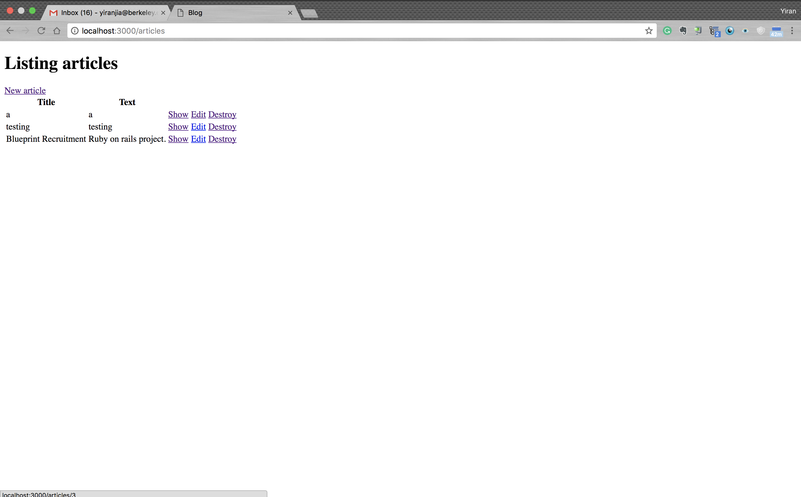

# README

This ruby website allows users to post and delete posts and comments. It's built by following the ruby on rails tutorial at http://guides.rubyonrails.org/getting_started.html.

Home Page

List of Articles

Create New Article

Comments

New List of Articles

